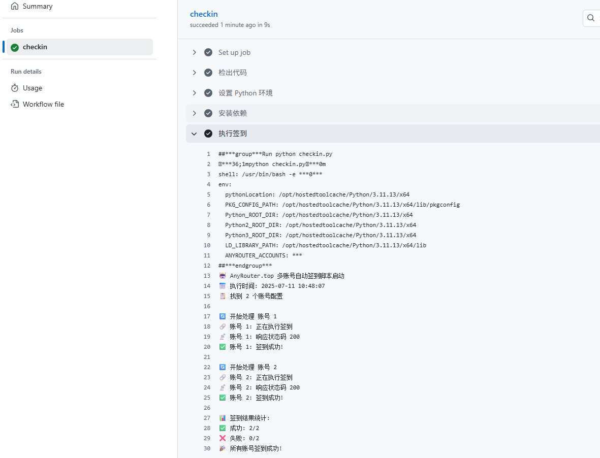

# AnyRouter 多账号自动签到

用于 Claude Code 镜像池 AnyRouter 多账号每日签到，一次 $10，限时注册即送 100 美金，[点击这里注册](https://anyrouter.top/register?aff=gSsN)。

## 功能特性

- ✅ 支持多账号同时签到
- ✅ 每个账号独立配置 cookies 和 API 用户标识
- ✅ 自动每日签到
- ✅ 支持手动触发
- ✅ 详细的签到结果统计

## 使用方法

### 1. Fork 本仓库

点击右上角的 "Fork" 按钮，将本仓库 fork 到你的账户。

### 2. 获取账号信息

对于每个需要签到的账号，你需要获取：
1. **Cookies**: 用于身份验证
2. **API User**: 用于请求头的 new-api-user 参数

#### 获取 Cookies：
1. 打开浏览器，访问 https://anyrouter.top/
2. 登录你的账户
3. 打开开发者工具 (F12)
4. 切换到 "Application" 或 "存储" 选项卡
5. 找到 "Cookies" 选项
6. 复制所有 cookies

#### 获取 API User：
通常在网站的用户设置或 API 设置中可以找到，每个账号都有唯一的标识。

### 3. 设置 GitHub Environment Secret

1. 在你 fork 的仓库中，点击 "Settings" 选项卡
2. 在左侧菜单中找到 "Environments" -> "New environment"
3. 新建一个名为 `production` 的环境
4. 点击新建的 `production` 环境进入环境配置页
5. 点击 "Add environment secret" 创建 secret：
   - Name: `ANYROUTER_ACCOUNTS`
   - Value: 你的多账号配置数据

### 4. 多账号配置格式

支持单个与多个

```json
[
  {
    "cookies": {
      "session": "account1_session_value"
    },
    "api_user": "account1_api_user_id"
  },
  {
    "cookies": {
      "session": "account2_session_value"
    },
    "api_user": "account2_api_user_id"
  }
]
```

通过 F12 工具可获取 cookies 与 api_user 的值。


### 5. 启用 GitHub Actions

1. 在你的仓库中，点击 "Actions" 选项卡
2. 如果提示启用 Actions，请点击启用
3. 找到 "AnyRouter 自动签到" workflow
4. 点击 "Enable workflow"

### 6. 测试运行

你可以手动触发一次签到来测试：

1. 在 "Actions" 选项卡中，点击 "AnyRouter 自动签到"
2. 点击 "Run workflow" 按钮
3. 确认运行



## 执行时间

- 脚本会在每天 UTC 时间 0:00 (北京时间 8:00) 自动执行
- 你也可以随时手动触发签到

## 注意事项

- 请确保每个账号的 cookies 和 API User 都是正确的
- 如果部分账号签到失败，请检查对应账号的配置
- 可以在 Actions 页面查看详细的运行日志
- 支持部分账号失败，只要有账号成功签到，整个任务就不会失败

## 配置示例

假设你有两个账号需要签到：

```json
[
  {
    "cookies": {
      "session": "abc123session"
    },
    "api_user": "user123"
  },
  {
    "cookies": {
      "session": "xyz789session"
    },
    "api_user": "user456"
  }
]
```

## 开启通知

脚本支持多种通知方式，可以通过配置以下环境变量开启，如果 `webhook` 有要求安全设置，例如钉钉，可以在新建机器人时选择自定义关键词，填写 `AnyRouter`。

### 邮箱通知
- `EMAIL_USER`: 发件人邮箱地址
- `EMAIL_PASS`: 发件人邮箱密码/授权码
- `EMAIL_TO`: 收件人邮箱地址

### 钉钉机器人
- `DINGDING_WEBHOOK`: 钉钉机器人的 Webhook 地址

### 飞书机器人
- `FEISHU_WEBHOOK`: 飞书机器人的 Webhook 地址

### 企业微信机器人
- `WEIXIN_WEBHOOK`: 企业微信机器人的 Webhook 地址

### PushPlus 推送
- `PUSHPLUS_TOKEN`: PushPlus 的 Token

### Server酱
- `SERVERPUSHKEY`: Server酱的 SendKey

配置步骤：
1. 在仓库的 Settings -> Environments -> production -> Environment secrets 中添加上述环境变量
2. 每个通知方式都是独立的，可以只配置你需要的推送方式
3. 如果某个通知方式配置不正确或未配置，脚本会自动跳过该通知方式

## 故障排除

如果签到失败，请检查：

1. 账号配置格式是否正确
2. cookies 是否过期
3. API User 是否正确
4. 网站是否更改了签到接口
5. 查看 Actions 运行日志获取详细错误信息

## 测试

```python
uv venv
.venv\Scripts\activate
pip install -r requirements-dev.txt
pytest tests/
```

## 免责声明

本脚本仅用于学习和研究目的，使用前请确保遵守相关网站的使用条款.